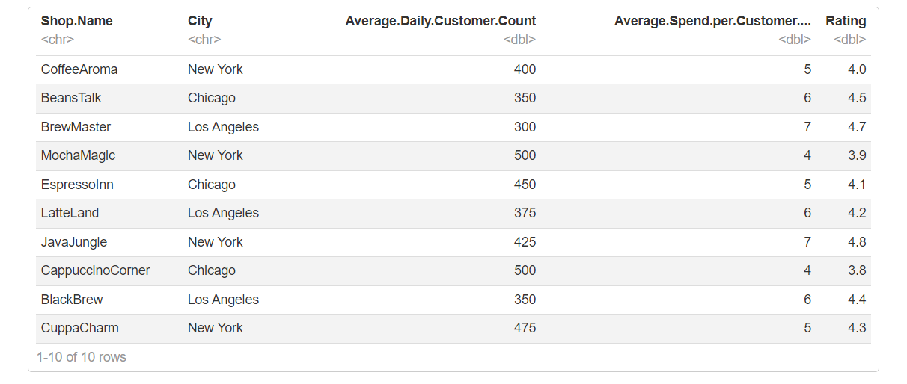
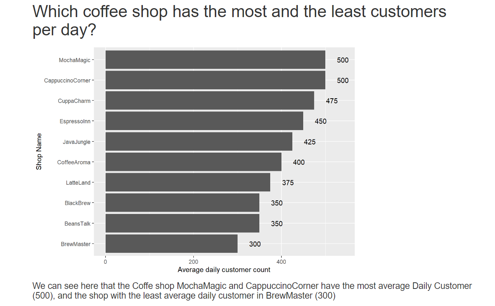
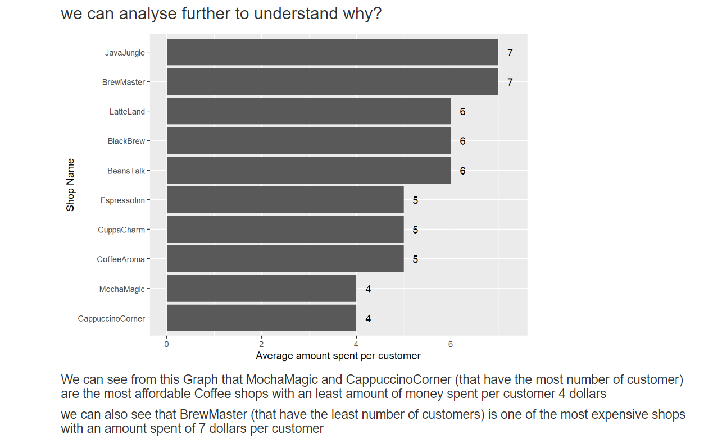
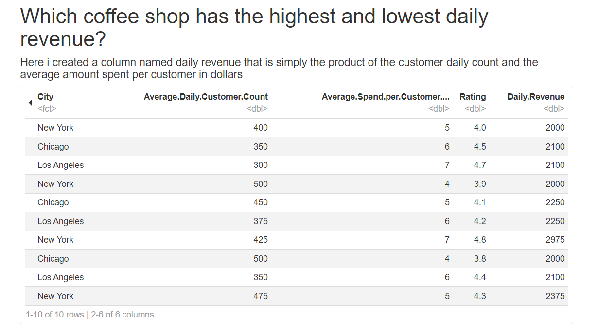
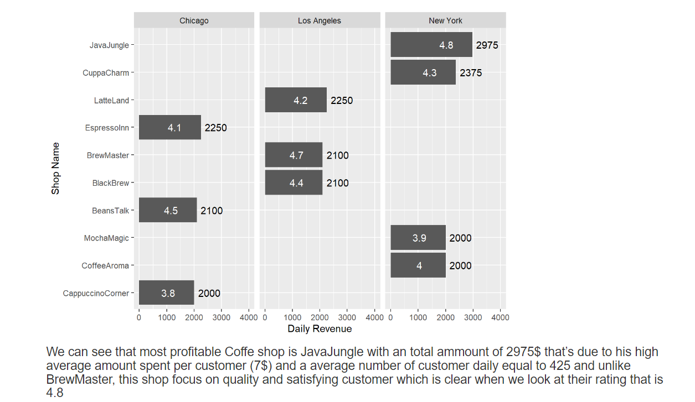
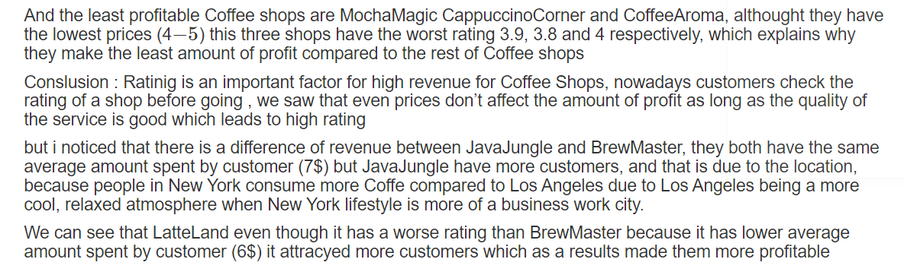
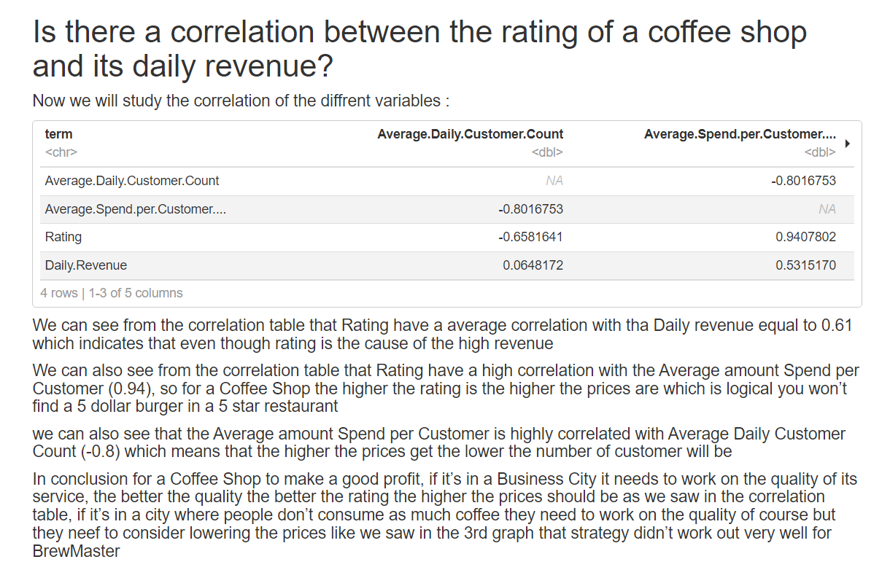

# Coffee_shop_Analysis

Objective: Analyze a small dataset

Task: Analyze this data and find out:
● Which coffee shop has the most and the least customers per day?
● Which coffee shop has the highest and lowest daily revenue?
● Is there a correlation between the rating of a coffee shop and its daily
revenue?

